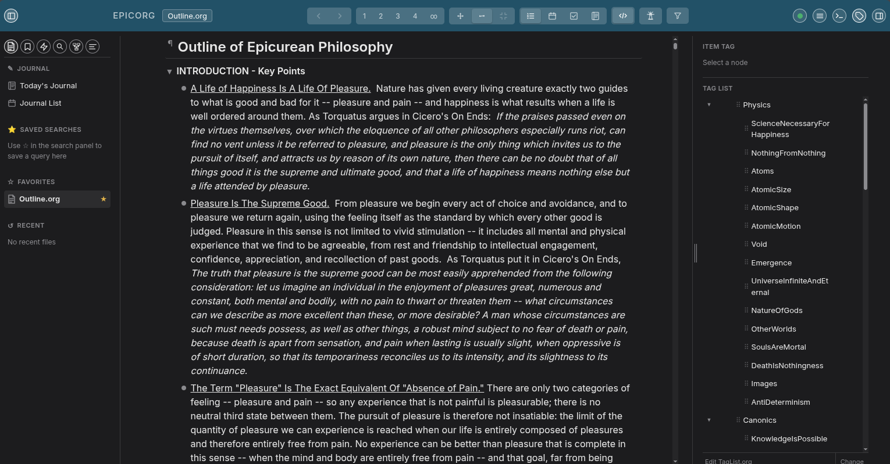
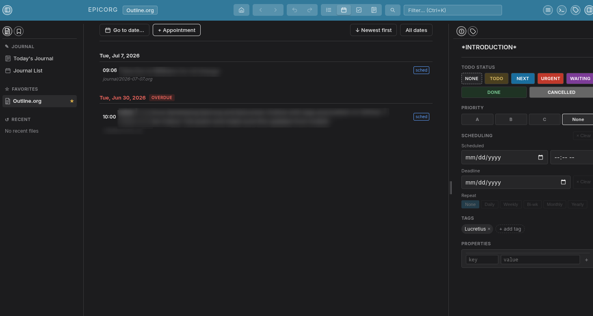

# epicorg

**Outlining - Free Local and Powerful — Using Org-Mode Files Without The Complexity Of Emacs.**

A free, open-source outline editor built on the robust org-mode format. Outline-centered like Dynalist or Workflowy — but your data stays in standard `.org` files on your own machine, editable in Emacs, any text editor, or epicorg itself.

This program was developed by Cassius Amicus for his own use in the study of Epicurean philosophy, but you are welcome to use it for your own purposes.  Epicorq was programmed using Go entirely by Claude.AI.  As of this writing it has been tested only on Linux, although Claude indicates that the Windows and MAC builds should work as well.  It is certainly not intended as a replacement for Emacs or Logseq or any other major program, but it is intended to be a basic single-pane outliner, easy to use (with menus) for non-specialists, while running under-the-hood on the powerful Org-mode outlining format, rather than markdown.

**How it runs:** epicorg is not a native desktop app — running the binary starts a small local web server on your own machine, and you use it through your regular web browser (the same pattern Jupyter notebooks use). Nothing is installed into your OS beyond the one binary, nothing leaves your computer, and no internet connection is required. Closing the browser tab doesn't stop the server; use Ctrl+C in the terminal (or close the terminal) to shut it down.





**[Sample Exported Outline](https://cassiusamicus.github.io/epicorg/Outline.html)** — see what an HTML export from epicorg actually looks like.

## Features

- **Infinite nesting** — headings, sub-headings, and body text to any depth
- **Keyboard-first** — navigate, create, indent, move, and fold without touching the mouse
- **Hover handle + per-node menu** — hover any bullet to reveal a drag handle to its left; drag it to reorder (the entire subtree moves with it, with a drop-line showing exactly where it will land), or click/right-click it for a quick menu — Duplicate, Delete, Move Up/Down, Indent/Outdent, Hoist. The bullet itself stays click-only (toggle/edit)
- **Split at cursor** — split a heading or note into two at the cursor position, from the keyboard (`Ctrl+Shift+S`), the command palette, or a note's right-click menu; the cursor always lands exactly where you clicked, never at the end of the text
- **Bullet styles** — choose Bullets, Numbers, or Letters (a–z / A–Z) globally or per level; preference saved to the org file so it survives across machines and browsers
- **Wiki-links** — type `[[` in any body note to get a title-picker that inserts a `[[Note Title]]` link; clicking it in preview navigates to that note; a **Linked References** panel at the bottom of each note lists every other note that links to it (matches both `[[Title]]` wiki-links and `[[file:...]]` file links); pasting a bare URL fetches the page title automatically to use as the link's label
- **Inline notes** — body text under each bullet; toggle all off for a quick scan, with a `…` marker on items with hidden notes
- **Rich inline formatting** — bold, italic, underline, and strikethrough (including combinations) follow real org-mode's boundary rules; quote, verse, src, example, and center blocks render too
- **Text mode** — view and edit the raw org source (asterisks, tags, `:PROPERTIES:` drawers) then toggle back to reparse
- **Detail pane** — status, due dates, tags, and custom properties for the focused item
- **Tag panel** — sidebar showing all tags; click to filter the outline; tag list can live in a dedicated `.org` file
- **Bookmark panel** — global bookmarks visible across all files; list can live in a dedicated `.org` file
- **TODO/DONE status** — clickable badges stored as standard org-mode keywords
- **Due dates & reminders** — date picker stored as `DEADLINE` in org properties; scheduled appointments trigger an on-screen popup ahead of time that stays until dismissed
- **Agenda view** — all dated items sorted chronologically with overdue/today indicators
- **Fold to level** — Alt+1 through Alt+9 collapses the outline to a given depth
- **Hoist** — isolate the focused item and its children, hiding the rest
- **Full-text search** — search across all org files in the workspace, with match navigation to step through results
- **Multi-file** — point epicorg at a directory; switch files from the picker; rename or delete from there too
- **Export to HTML** — self-contained HTML file with navigation panel, tag filter, dark/light toggle, and reading-width toggle; respects your bullet style and accent color
- **Export to org** — save a local copy of any file for backup or use outside epicorg
- **Undo/redo** — Ctrl+Z / Ctrl+Shift+Z, document-wide; typing coalesces per pause
- **Git-backed merge** — external edits are three-way merged via `git merge-file`; conflicts surface in the UI
- **Auto-commit** — snapshots on file load, after 20 minutes idle, and on shutdown
- **Numbered backups** — independent of git, keeps the last 5–10 (configurable in Settings → Versioning/Backups) Emacs-style `name.org.~N~` copies of each file alongside it, as a simple browsable fallback
- **Single binary** — one Go binary embeds the entire frontend; no npm, no bundler, no runtime dependencies

## Quick start

```bash
go build -o epicorg .
./epicorg ~/org
```

Opens `~/org` (created if it doesn't exist) and launches a browser tab. If the directory isn't a git repo epicorg initializes one.  On first run, if there are no other files in the ~org folder, the program will load Outline.org as a sample of what Epicorg can do.  If the included sample does not run, start the program:

```bash
./epicorg examples/
```

| Flag | Default | Description |
|------|---------|-------------|
| `[directory]` | `.` | Directory of `.org` files to serve |
| `-addr` | `:8080` | Listen address |
| `-file` | _(none)_ | Open this file automatically on startup |

## Download

Pre-built binaries for Linux, macOS, and Windows are published automatically as [nightly releases](../../releases/tag/nightly) from the main branch.  **NOTE:  This program has been tested only on Linux as of the time of this writing.**  

## Keyboard shortcuts

### Navigation

| Key | Action |
|-----|--------|
| `↑` / `↓` | Move focus |
| `Enter` | New sibling item |
| `Backspace` | Delete empty item |
| `Shift+Enter` | Edit notes under item |
| `Escape` | Return to title |
| `Alt+←` / `Alt+→` | Navigate history |

### Structure

| Key | Action |
|-----|--------|
| `Alt+Left` | Outdent (promote) |
| `Alt+Right` | Indent (demote) |
| `Alt+Up` | Move item up |
| `Alt+Down` | Move item down |

### Folding

| Key | Action |
|-----|--------|
| `Tab` | Fold / unfold children |
| `Alt+1` … `Alt+9` | Fold entire outline to level N |

### Formatting

| Key | Action |
|-----|--------|
| `Ctrl+B` | `*bold*` |
| `Ctrl+I` | `/italic/` |
| `Ctrl+U` | `_underline_` |

### Other

| Key | Action |
|-----|--------|
| `Ctrl+Z` | Undo |
| `Ctrl+Shift+Z` | Redo |
| `Ctrl+H` | Command palette |
| `Ctrl+Shift+S` | Split heading/note at cursor |
| `Ctrl+Shift+J` | Join with next node |

## Org file format

epicorg reads and writes standard org-mode files:

```org
#+TITLE: My Notes
#+EPICORG_FORMAT: numbers
* TODO Inbox
** DONE Buy milk
:PROPERTIES:
:DEADLINE: <2026-04-15 Wed>
:END:
** Write README
Body text goes here.
* Projects
** Build epicorg
:PROPERTIES:
:PRIORITY: high
:END:
*** Design the API
*** Implement frontend
```

`#+EPICORG_FORMAT` stores your bullet-style preference (bullets / numbers / letters / upper) so it opens the same way everywhere. When set to `numbers`, epicorg also writes `#+STARTUP: num` so Emacs `org-num-mode` activates automatically.

## Architecture

```
browser (React/htm)       Go server              disk
  local JSON tree  ──►  PUT /api/doc  ──►   .org file
  instant edits          JSON ↔ org            plain text
                         hash check + merge
```

**Frontend** owns the document as a JSON tree. All editing is instant local state — no network round-trip. A background sync pushes to the server every 3 seconds when dirty. Built with React and [htm](https://github.com/developit/htm) loaded from CDN; no npm, no bundler.

**Backend** (Go) translates between JSON and org-mode. Parsing uses [niklasfasching/go-org](https://github.com/niklasfasching/go-org). The compiled frontend is embedded in the binary via `//go:embed`.

**Conflict resolution** uses SHA-256 hashes. If the file changed on disk since last load, epicorg runs `git merge-file` for a three-way merge. Clean merges apply automatically; conflicts produce standard markers surfaced in the UI.

## Building

```bash
make build        # go build -o epicorg .
make test         # go test ./...
make run          # build + run in current directory
```

Go 1.21 or later required. No other build-time dependencies.

## Changelog

**2026-07-17**
- Fixed `Alt+Left`/`Alt+Right` sometimes navigating back/forward in epicorg's own file history instead of outdenting/indenting — note (body) fields had no indent/outdent handling at all, and even title fields could trigger both at once.
- Per-node menu: Cut/Copy now also write to the system clipboard (not just epicorg's internal one), added a node clipboard (Cut/Copy/Paste an outline item into another part of the tree), and added a Clean Text command.
- Popup menus (note right-click, per-node hamburger) now keep themselves fully on screen instead of getting cut off near the window edge.

**2026-07-16**
- Added Export to PDF, via the browser's native print dialog ("Save as PDF") rather than a bundled PDF renderer.
- Moved the note field's Insert Footnote/Image/Table buttons into its right-click menu, alongside Cut/Copy/Paste/Split/Join.
- Added Copy As Formatted/Plain Text to the per-node menu.

## Contributing

Cassius Amicus is the developer but the heavy lifting here has been done by Claude.  It is not the intent of Epicorg to compete with Emacs, Workflowy, Dynalist, Obsidian, or Logseq, and there are no plans to do so in the future.  Epicorg is designed to assist one user working closely with one of a few outlines for focused - close-in use.  To-do and agenda functionality have been included experimentally, but Epicorg is not intended to serve as a primary calendaring system, nor will it likely ever sync to Google or anything else.  All non-outlining functions are strictly secondary to the purpose of the program.  

Cassius himself uses Epicorgover a local network an with an org folder stored on the server (backed up by Nextcloud), and this allows easy editing of a single outline from multiple computers.  With the addition of Tailscale this works from outside the local LAN as well.

Bug reports and pull requests are welcome. Please open an issue before starting significant work so we can discuss the approach.  But a word to the wise:  I used Claude to produce this, and if Claude can't handle the proposed change I likely won't be able to implement it myself.

Unit tests live alongside the code they test. New functionality should include tests.

## Credits

Epicorg has been developed by Cassius Amicus for his own use in studying Epicurean philosophy.  You are welcome to use it for your own purposes.  You are also welcome to learn more about Epicurus by visiting [EpicureanFriends.com](https://epicureanfriends.com) and [EpicurusToday.com](https://epicurustoday.com)

Epicorg grew out of [torg](https://github.com/suprjinx/torg) by [Geoff Russ](https://github.com/suprjinx). The org-mode parsing engine is that of [niklasfasching/go-org](https://github.com/niklasfasching/go-org).

## License

GNU General Public License v3.0 — see [LICENSE](LICENSE) for the full text.
